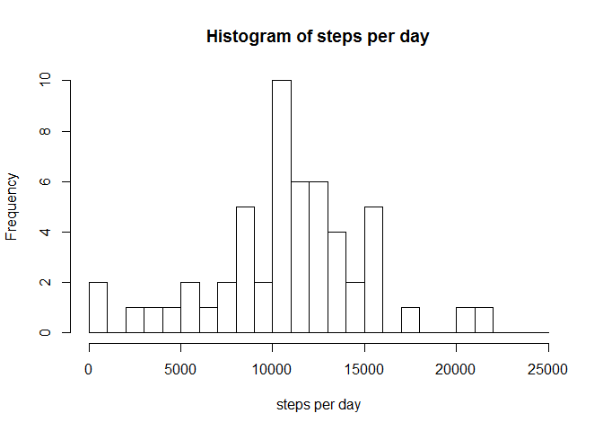
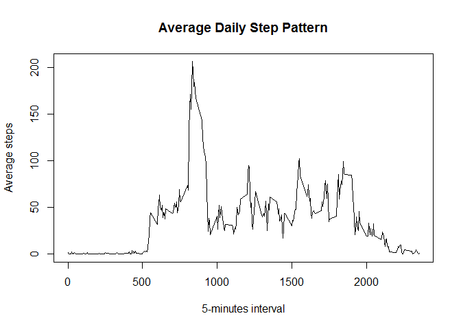
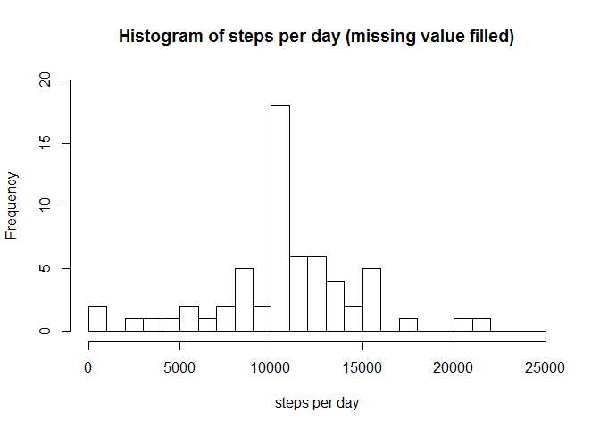
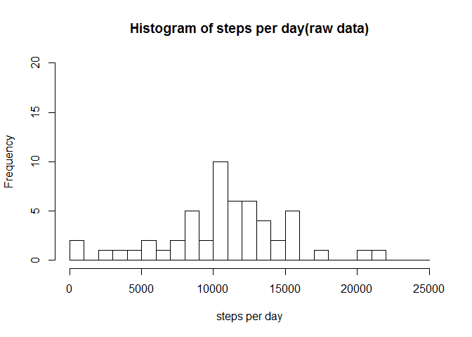
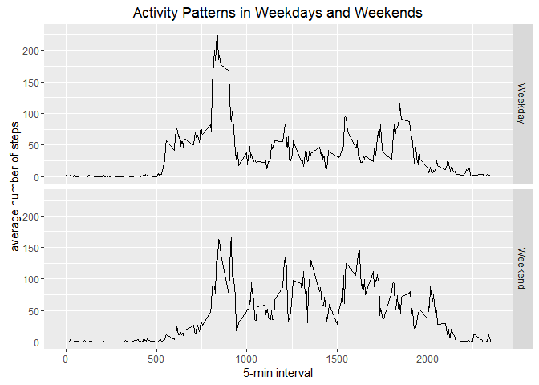

0. Getting data
---------------

I forked [original Github repo](https://github.com/rdpeng/RepData_PeerAssessment1.git) to [my repo](https://github.com/parkhstm/RepData_PeerAssessment1.git), and then cloned it to my local repo. The raw data file(activity.zip) in repo was unzipped to my working directory for R.

<br>

1. Loading and preprocessing the data
-------------------------------------

Loading data with `read.csv` function, defining NAs as the string "NA".

``` r
actdata <- read.csv(file="activity.csv", na.strings = "NA", stringsAsFactors = F)
```

Transform the 'date' variable into date format using`as.Date`

``` r
actdata$date <- as.Date(actdata$date, format="%Y-%m-%d")
```

<br>

2. What is mean total number of steps taken per day?
----------------------------------------------------

#### Approach

1.  Calculate the total number of steps taken per day
2.  Make a histogram of the total number of steps taken each day
3.  Calculate and report the mean and median of the total number of steps taken per day

-   Note: In this part of analysis, NA values are ignored.

<br>

Calculate sum of steps for each day by `tapply`

``` r
stepday <- tapply(actdata$steps, INDEX=actdata$date, sum)
```

Make a histogram

``` r
hist(stepday, breaks=seq(0,25000, by=1000), xlab="steps per day", main="Histogram of steps per day")
```

<!-- -->

Calculate mean

``` r
mean(stepday, na.rm=T)
```

    ## [1] 10766.19

calcuate median

``` r
median(stepday, na.rm=T)
```

    ## [1] 10765

Mean of steps for each day is **10766.19**
Median of steps for each day is **10765**

<br>

3. What is the average daily activity pattern?
----------------------------------------------

#### Approach

1.  Calculate average steps for each interval across all days
2.  Plot average step and interval
3.  Find maximum average steps and the interval contains it

<br>

Calculate average steps using `tapply`

``` r
avgstep <- tapply(actdata$steps, INDEX=factor(actdata$interval) , function(x) mean(x, na.rm=T))
```

plot

``` r
plot(avgstep~dimnames(avgstep)[[1]], type="l", xlab="5-minutes interval", ylab="Average steps", main="Average Daily Step Pattern")
```

<!-- -->

Find Max average step value by `max` and find its interval by `which`

``` r
avgstep[which(avgstep == max(avgstep))]
```

    ##      835 
    ## 206.1698

Maxmum average step value across days is **206.1698** in interval **835**.

<br>

4. Imputing missing values
--------------------------

1.  Calculate and report the total number of missing values in the dataset.
2.  Devise a strategy for filling in all of the missing values in the dataset. & Create a new dataset with the missing data filled in.
3.  Do analysis in section 2 with new dataset. And compare it with previous ones and find the impact of imputing missing data on the estimates of the total daily number of steps.

### 4-1 Calcuate total number of missing values

calculate total number and proportion of missing values(NA) in dataset

``` r
sum(is.na(actdata$steps)) #total number
```

    ## [1] 2304

``` r
mean(is.na(actdata$steps)) #proportion
```

    ## [1] 0.1311475

Total number of missing value in the dataset is **2304**, and it is about 13% of the steps values.

<br>

### 4-2 Devise strategy for filling missing values

1.  Examine the distribution of the missing values.
2.  Fill the missing values of each intervals, by using the average of same intervals.

#### 4-2-1 Examine missing values

Find the proportion of missing values by date and intervals

``` r
NAdays <- tapply(actdata$steps, actdata$date, function(x) mean(is.na(x)))
NAdays
```

    ## 2012-10-01 2012-10-02 2012-10-03 2012-10-04 2012-10-05 2012-10-06 
    ##          1          0          0          0          0          0 
    ## 2012-10-07 2012-10-08 2012-10-09 2012-10-10 2012-10-11 2012-10-12 
    ##          0          1          0          0          0          0 
    ## 2012-10-13 2012-10-14 2012-10-15 2012-10-16 2012-10-17 2012-10-18 
    ##          0          0          0          0          0          0 
    ## 2012-10-19 2012-10-20 2012-10-21 2012-10-22 2012-10-23 2012-10-24 
    ##          0          0          0          0          0          0 
    ## 2012-10-25 2012-10-26 2012-10-27 2012-10-28 2012-10-29 2012-10-30 
    ##          0          0          0          0          0          0 
    ## 2012-10-31 2012-11-01 2012-11-02 2012-11-03 2012-11-04 2012-11-05 
    ##          0          1          0          0          1          0 
    ## 2012-11-06 2012-11-07 2012-11-08 2012-11-09 2012-11-10 2012-11-11 
    ##          0          0          0          1          1          0 
    ## 2012-11-12 2012-11-13 2012-11-14 2012-11-15 2012-11-16 2012-11-17 
    ##          0          0          1          0          0          0 
    ## 2012-11-18 2012-11-19 2012-11-20 2012-11-21 2012-11-22 2012-11-23 
    ##          0          0          0          0          0          0 
    ## 2012-11-24 2012-11-25 2012-11-26 2012-11-27 2012-11-28 2012-11-29 
    ##          0          0          0          0          0          0 
    ## 2012-11-30 
    ##          1

In above result, there is only 1. That means **NA values are only in certain days**, and these days have NA values 100% only. And there is no NA values in other days.

To confirm this result, cross validate with intervals

``` r
unique(tapply(actdata$steps, actdata$interval, function(x) mean(is.na(x))))
```

    ##         0 
    ## 0.1311475

Every intervals have same value of 0.1311475. This means there is no difference in distribution of steps value by intervals.

Further evaluation on the day that have missing values

``` r
dimnames(NAdays)[[1]][which(NAdays==1)]
```

    ## [1] "2012-10-01" "2012-10-08" "2012-11-01" "2012-11-04" "2012-11-09"
    ## [6] "2012-11-10" "2012-11-14" "2012-11-30"

Assuming human activity is similar depending on weekday, find weekday of the day have missing values.

``` r
Sys.setlocale("LC_TIME","English") ##set language output for weekday as English.
```

    ## [1] "English_United States.1252"

``` r
weekdays(as.Date(dimnames(NAdays)[[1]][which(NAdays==1)], format="%Y-%m-%d"))
```

    ## [1] "Monday"    "Monday"    "Thursday"  "Sunday"    "Friday"    "Saturday" 
    ## [7] "Wednesday" "Friday"

The missing values are recorded in "Monday"", "Thursday", "Wednesday", "Friday", "Saturday", "Sunday". It seems that there is no special weekday for having more missing value days.

<br>

#### 4-2-2 Fill the missing values

1.  Calculate average steps values for the each intervals.
2.  Fill missing vlaues with calculated average steps values
3.  Make New dataframe with filled missing values <br> Average steps for interval is calculated above, and stored at `avgstep`.

fill the missing values by`match`

``` r
filldata <- actdata #new data frame
narow <- which(is.na(actdata$steps)) #row number with NAs

est.step <- as.vector(avgstep) #estimated steps values for each intervals
intv <- as.numeric(dimnames(avgstep)[[1]]) #intervals

filldata[narow,1] <- est.step[match(filldata[narow,3], intv)]
```

<br>

### 4-3. Make a histogram, Calculate and report the mean and median total number of steps per day

#### 4-3-1 Make histogram

Calculate sum of steps for each day by `tapply` from `filldata`

``` r
stepdayf <- tapply(filldata$steps, INDEX=filldata$date, sum)
```

Draw histogram and compare with that from raw data

``` r
hist(stepdayf, breaks=seq(0,25000, by=1000), xlab="steps per day", main="Histogram of steps per day (missing value filled)", ylim=c(0,20))
```

<!-- -->

``` r
hist(stepday, breaks=seq(0,25000, by=1000), xlab="steps per day", main="Histogram of steps per day(raw data)", ylim=c(0,20))#histogram for raw data with modified y axis for comparision
```

<!-- -->

Upper histogram is drawn from the data which missing data was filled by average value. Because the average values of each intervals were used, this histogram have taller (higher) frequency in the break contains mean value.

#### 4-3-2 Median and mean

Calculate mean for `filldata`

``` r
mean(stepdayf, na.rm=T)
```

    ## [1] 10766.19

calcuate median for `filldata`

``` r
median(stepdayf, na.rm=T)
```

    ## [1] 10766.19

The mean and median value for missing-filled dataset are same value of **10766.19**. Which is same as mean value from raw data. The median value is differ from raw data, which was 10765.

<br>

5. Are there differences in activity patterns between weekdays and weekends.
----------------------------------------------------------------------------

1.  Create a new factor variable in the dataset with two levels ??? “weekday” and “weekend”
2.  Calculate average for steps in each interval on each weekday and weekend
3.  Make a panel plot containing a time series plot of the 5-minute interval and the average number of steps, averaged across all weekday days or weekend days

### 5-1 Create new factor variable

Make a new vector for weekday

``` r
wkday <- weekdays(filldata$date)
```

Make a new variable for weekday/weekend

``` r
dayend <- wkday
dayend[which(wkday=="Sunday"|wkday=="Saturday")] <- "Weekend" #assign weekend for Sun. and Sat.
dayend[-(which(wkday=="Sunday"|wkday=="Saturday"))] <- "Weekday" #weekday for remains

dayend <- factor(dayend) #make factor variable
 
datawk <- cbind(filldata, dayend)
```

### 5-2 Calculate average

split `datawk` by weekday and weekend

``` r
spldatawk <- split(datawk, datawk$dayend)
```

calculate average

``` r
avgwd <- tapply(spldatawk$Weekday$steps, spldatawk$Weekday$interval, mean)
avgwd <- as.vector(avgwd)
avgwe <- tapply(spldatawk$Weekend$steps, spldatawk$Weekend$interval, mean)
avgwe <- as.vector(avgwe)
```

Craete new dataframe

``` r
weekdayavg <- data.frame(avg_steps=avgwd, intervals=intv, week = rep("Weekday",288))
weekendavg <- data.frame(avg_steps=avgwe, intervals=intv, week = rep("Weekend",288))

avgbyweek <- rbind(weekdayavg, weekendavg)
```

### 5-3 Make plot

``` r
library(ggplot2)
attach(avgbyweek)
ggplot(data=avgbyweek, aes(intervals, avg_steps)) +geom_line() + facet_grid(week~.) + xlab("5-min interval") + ylab("average number of steps") +ggtitle("Activity Patterns in Weekdays and Weekends")
```

<!-- -->
